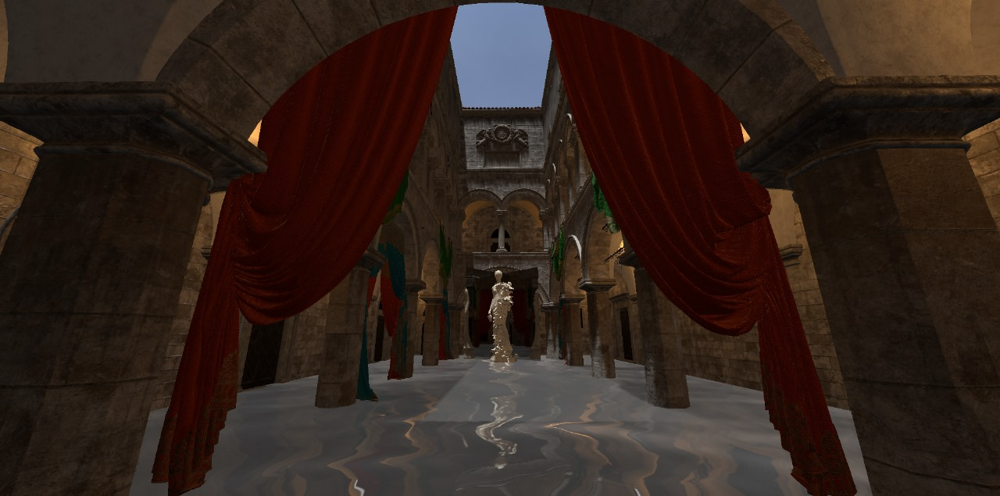
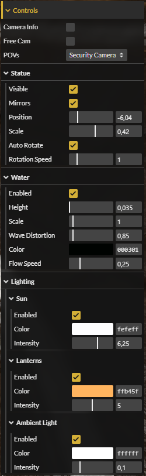
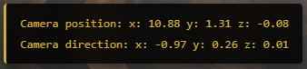

# Reflections of Sponza



## Introduction
This repository contains the final project for the second unit of the MATA65 - Computer Graphics course at the Federal University of Bahia (UFBA), taught by Professor [Antônio Apolinário](https://computacao.ufba.br/pt-br/antonio-lopes-apolinario-junior) during the 2024.2 semester.

We were tasked with developing a [Three.js](https://threejs.org/) application to visualize the [Sponza Palace model by Intel](https://www.intel.com/content/www/us/en/developer/topic-technology/graphics-research/samples.html). The goal was to implement physically plausible lighting and demonstrate Three.js's capability to simulate specific optical phenomena.

## How to Run

> **⚠️ Note on Performance:** The Intel models feature high polygon counts and high-resolution textures. Consequently, the application requires significant system resources and may experience long loading times depending on your hardware.

### 1. Clone the repository
```bash
git clone https://github.com/LucasTBorges/Reflections-of-Sponza.git
cd Reflections-of-Sponza
```

### 2. Install Sponza Assets (Crucial Step)
Because the Intel Sponza assets are considerably large, they are not included in this repository. You must download them manually:

1.  Download `main_sponza.zip` and `pkg_a_curtains.zip` from the [Intel Graphics Research Samples page](https://www.intel.com/content/www/us/en/developer/topic-technology/graphics-research/samples.html).
2.  Extract the contents of both zip files into the `/src/assets/` folder of this project.
3.  **Cleanup (Optional):** You can safely delete the `.png` render previews and other formats (`.obj`, `.usd`), keeping only the `.gltf`, `.bin`, and the `textures` folder.

**Expected Folder Structure:**
```
Reflections-of-Sponza/
└── src/
    └── assets/
        ├── main_sponza/      <-- Extracted from main_sponza.zip
        │   ├── main_sponza.gltf
        │   ├── main_sponza.bin
        │   └── textures/
        └── pkg_a_curtains/   <-- Extracted from pkg_a_curtains.zip
            ├── ...
```

*Note: The application handles missing curtains gracefully, but the base `main_sponza` files are required for startup.*

### 3. Start a local server
Because of browser security restrictions (CORS) regarding loading local files, you cannot simply open `index.html`. You must run a local server:

* **VS Code (Recommended):** Install the "Live Server" extension and click "Go Live" on `index.html`.
* **Python:**
  
    ```bash
    # Python 3.x
    python -m http.server
    ```
* **Node.js:**
  
  ```bash
    npx http-server
  ```

### 4. Open in Browser
Navigate to `http://localhost:5500` (or the port specified by your server terminal).

---

## Assets Utilized

### Repository Assets
The following assets are included in this repo:
* **Statue:** A 3D model published on Sketchfab by user [Huargenn](https://sketchfab.com/Huargenn). Available [here](https://sketchfab.com/3d-models/estatua-statue-907ae2bb4f23423db76b7ec9cfe6b0e9).
* **Water Normal Map:** Standard normal texture from the [Three.js repository](https://github.com/mrdoob/three.js/blob/master/examples/textures/waternormals.jpg).

### External Intel Assets
Assets from the Sponza 2022 scene, commissioned by [Frank Meinl](https://www.artstation.com/digitalwerk) and sponsored by [Anton Kaplanyan](http://kaplanyan.com/). These must be downloaded separately:
* **Sponza Palace Base Model:** Available on [Intel's Website](https://www.intel.com/content/www/us/en/developer/topic-technology/graphics-research/samples.html).
* **Sponza Curtains:** Available on [Intel's Website](https://www.intel.com/content/www/us/en/developer/topic-technology/graphics-research/samples.html).
* **Environment Map:** Bundled with the Sponza Palace Base Model textures.

## Technical Features

### Lighting
The base model includes embedded light sources (a Directional "Sun" and Point "Lanterns"). To achieve photorealism, I enhanced the lighting logic:
* **Calibration:** Adjusted light intensities for natural exposure.
* **Alignment:** Matched the Sun's direction to the visual hot spot on the skybox texture.
* **Global Illumination:** Added an Ambient Light to approximate indirect lighting.

### Shadows
To resolve the "floating object" look, shadow mapping was enabled.
* **Optimization:** Shadows are cast exclusively by the Sun (Directional Light). Calculating shadows for the dozens of point lights (lanterns) was computationally prohibitive for WebGL.
* **Frustum Tuning:** I manually adjusted the shadow camera's frustum to ensure it covers the entire atrium without clipping the architecture.

### Skybox
I implemented a `GroundedSkyBox` using the HDR texture provided with the Sponza assets to create a seamless horizon effect visible from the atrium.

## Scene Layout & Optical Effects
1.  **Water Plane:** Simulates reflection and refraction with wave distortion.
2.  **Mirrors:** A pair of reflective surfaces demonstrating real-time planar reflections.
3.  **Rotating Statue:** Placed in the center to demonstrate dynamic reflections. The mirrors track the statue's translation and scale but do not inherit its rotation.

## Camera Controls
The application supports two navigation modes:

1.  **Free Cam:** Uses Three.js [FlyControls](https://threejs.org/docs/#examples/en/controls/FlyControls) for unrestricted 6DOF navigation.
    * **Mouse:** Click and drag to look around (`dragToLook` enabled).
    * **Keyboard:** `WASD` to move, `R/F` to move Up/Down, `Q/E` to Roll.
2.  **Fixed POVs:** A list of pre-defined viewpoints (e.g., "Entrance", "Second Floor").
    * *Security Camera Logic:* When active, this camera dynamically tracks the Statue's position if the user moves it.

## GUI Controls
The interface is built with [lil-gui](https://lil-gui.georgealways.com/).

<details>
  <summary><strong>Click to view GUI Screenshot</strong></summary>
  
</details>

### Basic Controls

 - **Camera Info**: Toggles the debug panel (bottom right) showing current position/direction vectors for the camera.

 - **Free Cam**: Enables FlyControls navigation.

 - **POVs**: Dropdown to teleport to specific viewpoints.

### Statue

 - **Visible / Mirrors**: Toggles visibility.

 - **Position**: Moves the statue (and mirrors) along the X-axis of the atrium.

 - **Scale**: Resizes the statue and mirrors.

 - **Auto Rotate**: Toggles the local Y-axis rotation animation.

 - **Rotation Speed**: Adjusts the angular velocity (rad/s).

### Water

 - **Enabled**: Toggles visibility.

 - **Height**: Adjusts the water level (Y-axis).

 - **Wave Distortion**: Controls the strength of the refraction/reflection distortion.

 - **Flow Speed**: Controls the texture offset animation speed.

### Lighting

Controls are grouped by light source (Sun, Lanterns, Ambient).

 - **Enabled**: Toggles specific lights.

 - **Color / Intensity**: Real-time adjustment of light properties.

## Customization: Adding POVs
To add custom viewpoints, edit the `index.js` file at the root of the repository. Add a new entry to the `povs` object:

```javascript

import Aplicacao from "./src/project/base/aplicacao.js";

const povs = {
    "Entrance": {pos: [10.88,1.31,-0.08], dir: [-0.97,0.26,0.01]},
    "Second Floor": {pos: [8.39,7.28,-1.71], dir: [-0.88,-0.38,0.27]},
    "Looking at Sky": {pos: [5.48,1.6,-0.52], dir: [-0.44,0.9,0.02]},
    "Top-Down": {pos: [0.11, 14.43, 0.29], dir:[0,-1,0]},
    "Security Camera": {pos: [0.06,5.95,-1.47], dir: [-0.82,-0.53,0.23]}
};

new Aplicacao("Sponza Palace", povs).init();
```

**How to find coordinates:**
<br>

1.  Enable **Free Cam** and **Camera Info** in the GUI.
2.  Fly to your desired location.
3.  Note the **Position** and **Direction** values displayed in the bottom-right info panel.
4.  Add these values to the `povs` object and restart the server.
